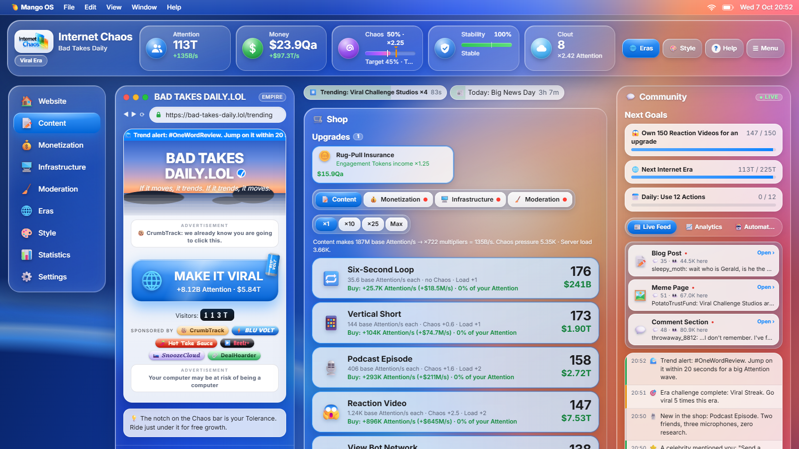
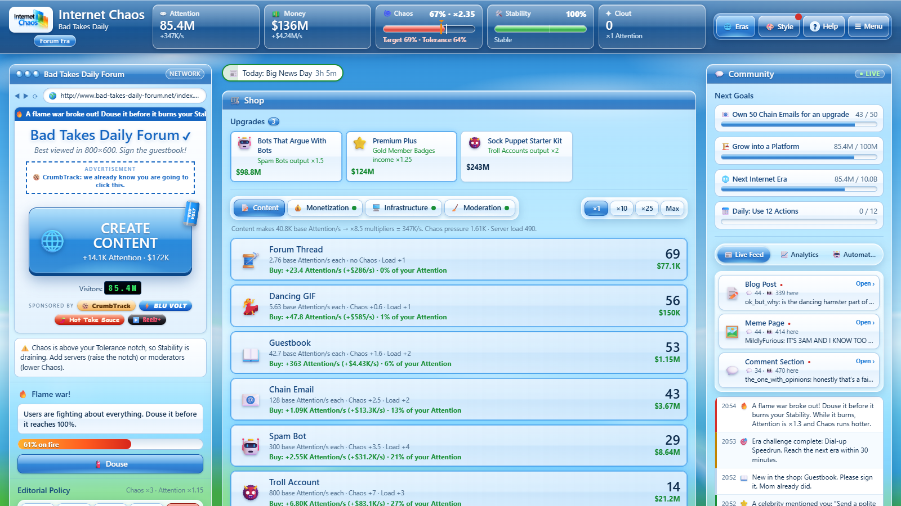
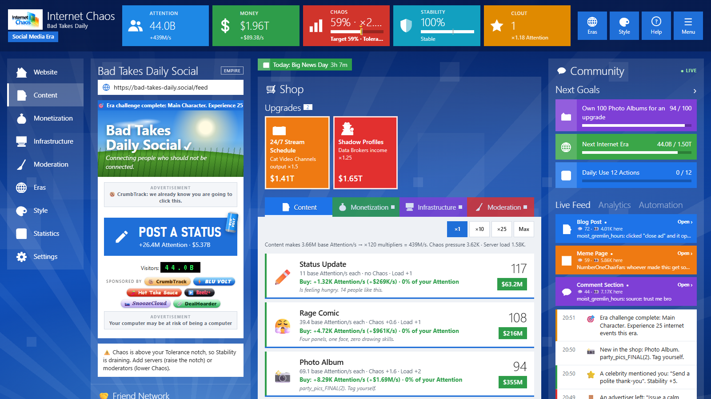
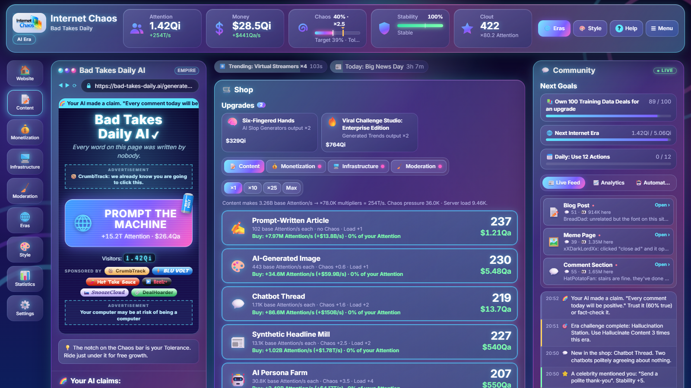
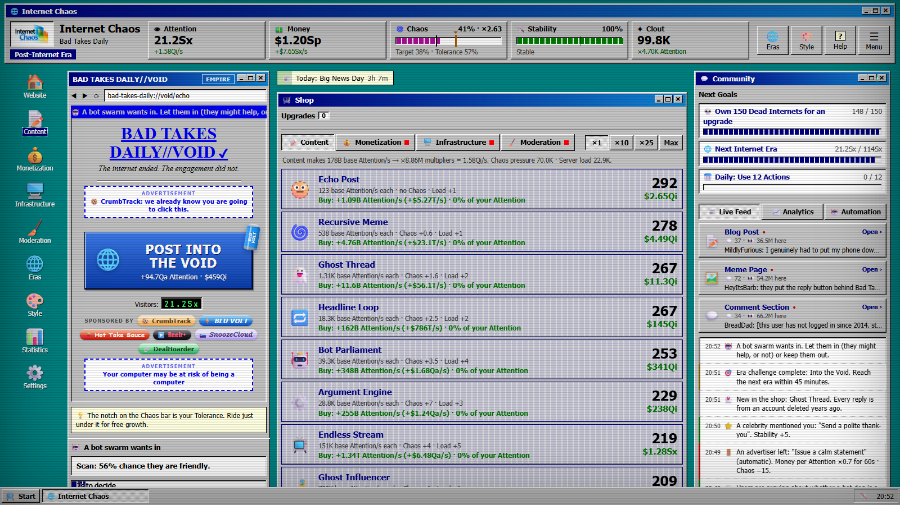
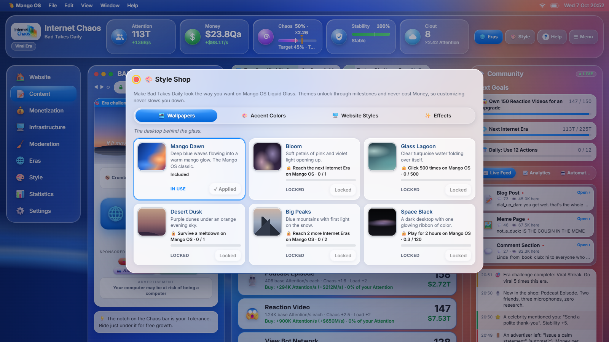
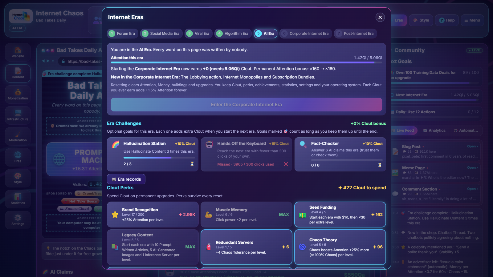

<div align="center">


### Grow one useless website into an absurd internet empire.

An idle / incremental browser game about clicks, content, chaos and seven eras of internet history.
No install, no account, no ads. Just open it and start posting.


<!-- Replace with a link to the live game when it is online, for example:
[**▶ Play in your browser**](https://example.com/internet-chaos) -->

</div>

<p align="center">
  
</p>

---

## About the game

You start with an empty homepage and one big button. Every click creates content, content
earns **Attention**, and Attention earns **Money**. Spend it on content, ads, servers and
moderators, and watch your site grow from a forum nobody visits into the last platform on
the internet.

The catch is **Chaos**. Messy content multiplies everything you earn, but push it past what
your servers can handle and **Stability** starts to drain. At 0% your site melts down. The
whole game is a balancing act between growth and keeping the lights on.

## Features

- 🌐 **Seven Internet Eras**: Forum, Social Media, Viral, Algorithm, AI, Corporate and
  Post-Internet, each with its own website style, button and unlocks
- 🛒 **A new shop in every era**: 171 themed shop items across Content, Monetization,
  Infrastructure and Moderation, from Dancing GIFs and Guestbooks to Vertical Shorts,
  Podcasts and Ghost Influencers
- 🌀 **Chaos and Stability**: a risk-and-reward system where your best growth sits just below
  meltdown
- 🎲 **A signature mechanic in every era**: flame wars, a friend network, trend alerts, a feed
  switch, AI claims to fact-check, quarterly targets and bot swarms
- 🔁 **Reboot the Internet**: after the Post-Internet Era, start the whole internet over on
  v2, v3 and beyond for Bandwidth, permanent upgrades that make every new internet faster,
  plus optional hard-mode protocols and a record for your fastest full internet
- 🎯 **Era challenges**: three optional goals per era that pay extra Clout
- 📅 **Daily challenge**: a new modifier and goal every day, the same for everyone, with streaks
- 🏁 **Era records**: every finished era with its time and Clout, plus your personal bests
- 💻 **Five operating systems**: glossy *ChaosOS 7 Aero*, tiled *ChaosOS 8 Metro*, *Mango OS
  Liquid Glass*, holographic *Prism OS* and the retro CRT *ChaosOS 95*, each with a full new
  interface, stacking bonuses and its own music
- 🎨 **Style Shop**: 104 wallpapers, colors, website styles and effects, most of them unlocked
  through milestones, never with real money
- 📸 **Share your website**: a picture of your site and its numbers, ready to post
- ⌨️ **Keyboard shortcuts** and 🇨🇿 **Czech language** support
- 🎵 **Generative music**: ambient, lo-fi and glassy electronic tracks synthesized live in the
  browser, with no audio files
- 📰 **A living website**: blog posts, memes and comment sections whose comments react to how
  chaotic your site is
- ✦ **Clout and Perks**: start a new era with permanent bonuses and spend Clout on perks
- 🏆 **Achievements, events and sponsors**: random events, tough choices, trending topics,
  floating bonuses and brand deals
- 💾 **Safe saves**: autosave, backups, save codes and offline progress while you are away
- 📱 **Plays anywhere**: desktop and mobile browsers, with reduced-motion support

## Gameplay

```
   👆 Click  ──►  👁 Attention  ──►  💵 Money  ──►  🛒 Buildings
                       ▲                                 │
                       └──────── more every second ──────┘
```

| Resource | What it does |
| --- | --- |
| 👁 **Attention** | Your main score. Clicks and Content make it, and it counts toward the next era. |
| 💵 **Money** | Earned from Attention every second. Monetization makes each point worth more. |
| 🌀 **Chaos** | Boosts Attention and Money. Content raises it, Moderation pulls it down. |
| 🛠️ **Stability** | Drains while Chaos is above your Tolerance, repairs below it. 0% means meltdown. |
| ✦ **Clout** | Earned when you move to a new era. Permanent bonuses and perks. |
| 📡 **Bandwidth** | Earned when you reboot the whole internet. Upgrades that survive everything. |

### The Internet Eras

Each era resets your website but keeps your Clout, perks, achievements and operating
system. Every era has its own shop, so nothing you buy repeats.

| Era | The internet of… | Some of the shop | Era mechanic |
| --- | --- | --- | --- |
| 1 · Forum Era | guestbooks, webrings and dial-up | Forum Thread, Dancing GIF, Chain Email, Dial-up Modem | Flame wars |
| 2 · Social Media Era | status updates and photo albums | Status Update, Rage Comic, Farm Game Coin Pack, Report Button | Friend network |
| 3 · Viral Era | short video, podcasts and challenges | Six-Second Loop, Vertical Short, Podcast Episode, Influencer Squad | Trend alerts |
| 4 · Algorithm Era | feeds that know you too well | Engagement Bait Post, Infinite Scroll Feed, Shadowban Filter | Feed mode |
| 5 · AI Era | everything generated | AI-Generated Image, Deepfake Studio, GPU Rack, Prompt Guardrail | AI claims |
| 6 · Corporate Internet Era | brands, bundles and lobbying | Thought Leadership Post, Cookie Consent Wall, Lobbying Office | Quarterly targets |
| 7 · Post-Internet Era | bots talking to bots | Echo Post, Ghost Influencer, Haunted Rack, Last Moderator | Bot swarms |

After the Post-Internet Era you can **reboot the internet**: back to the Forum Era on a new
version, without Clout and perks but with Bandwidth for upgrades that survive every reboot.
Pick a harder protocol, like Dial-up Only, for more Bandwidth next time.

### Tips

- Keep Chaos just under the **Tolerance** notch on the Chaos bar. That is where growth is fastest.
- Servers raise Tolerance; moderators lower Chaos. Buy both before things get exciting.
- Follow **Next Goals** when you are not sure what to do next.
- Catch the floating notification bell for a surprise bonus.
- Space clicks, 1–4 switch shop tabs, B buys the best-value building. The full list is in Help.

## Screenshots

| Forum Era · ChaosOS 7 Aero | Social Media Era · ChaosOS 8 Metro |
| :---: | :---: |
|  |  |
| **AI Era · Prism OS Hologram** | **Post-Internet Era · ChaosOS 95 Retro CRT** |
|  |  |
| **Style Shop on Mango OS** | **Internet Eras: challenges and Clout perks** |
|  |  |

The picture at the top shows the Viral Era on Mango OS Liquid Glass, with a trend alert.
All screenshots are taken from the real game by `python tools/screenshots.py`.

## Play locally

The game is plain HTML, CSS and JavaScript with no dependencies.

1. Download or clone this repository.
2. Open `index.html` in a modern browser (Chrome, Edge, Firefox or Safari).

Progress is saved in your browser automatically. Use **Settings → Download backup** to keep
a copy or move your game to another browser.

## Build for the web

```bash
python tools/build.py
```

This creates `dist/`, the version to upload to a static host such as itch.io or GitHub
Pages, plus `release/internet-chaos-web.zip`. All scripts are combined into one minified
file with no source maps, and the stylesheet and page are minified too. The build needs only
Python 3.8+; it downloads the `esbuild` minifier once and verifies it before use.

## Project structure

```
index.html      the game page
css/            styles: eras, operating system skins and themes
js/             game code: content, rules (systems), interface (ui), saves and audio
assets/         logo and icons
tools/          production build, balance simulator and developer checks
docs/           development notes and README images
```

More detail on the systems, balancing and saves is in
[docs/DEVELOPMENT.md](docs/DEVELOPMENT.md).

## Credits

Internet Chaos is a game by **DPLDS**.
"ChaosOS" and "Mango OS" are made-up names. Any resemblance to real operating systems is
for comedy.
